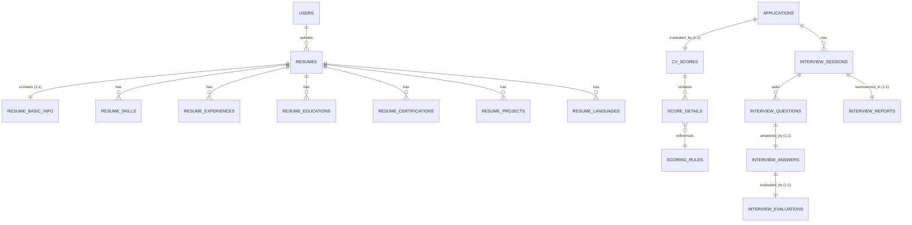

# AI-Hires: Tài Liệu Thiết Kế Database & Kế Hoạch Triển Khai Chi Tiết
> Hệ thống phân tích CV tự động (ATS) và Phỏng vấn thông minh dựa trên AI

Tài liệu này mô tả chi tiết kiến trúc cơ sở dữ liệu mở rộng, cấu trúc các bảng dữ liệu, mối quan hệ thực thể (ERD) và lộ trình triển khai chi tiết cho hai phân hệ cốt lõi: **Phân tích CV (CV Parsing/Scoring)** và **Hệ thống Phỏng vấn trực tuyến (AI Interview)**.

---

## I. KIẾN TRÚC TỔNG QUAN & ERD (Entity-Relationship Diagram)

Hệ thống đã loại bỏ hoàn toàn việc lưu trữ các tệp JSON cồng kềnh trong cơ sở dữ liệu để chuyển sang mô hình quan hệ chuẩn hóa (3NF). Điều này giúp hệ thống dễ dàng truy vấn, lập báo cáo, lọc ứng viên và mở rộng quy mô trong tương lai.

---

## II. THIẾT KẾ CHI TIẾT CÁC BẢNG DỮ LIỆU

### PHÂN HỆ 1: CV PARSING & DATA EXTRACTION
Hệ thống bóc tách tự động thông tin từ file CV bằng Apache Tika và Google Gemini AI, sau đó lưu trữ có cấu trúc vào các bảng dưới đây.

#### 1. `resume_basic_info` (Thông tin cá nhân cơ bản)
*Mối quan hệ: 1:1 với bảng `resumes`*

| Tên trường | Kiểu dữ liệu | Ràng buộc | Mô tả |
|---|---|---|---|
| `id` | `BIGINT` | `PK, AUTO_INCREMENT` | Khóa chính của bảng |
| `resume_id` | `BIGINT` | `FK, UNIQUE, NOT NULL` | Liên kết đến bảng `resumes` |
| `full_name` | `VARCHAR(255)` | | Họ và tên đầy đủ của ứng viên |
| `email` | `VARCHAR(100)` | | Địa chỉ Email liên hệ |
| `phone` | `VARCHAR(20)` | | Số điện thoại liên lạc |
| `address` | `VARCHAR(255)` | | Địa chỉ nơi ở hiện tại |
| `date_of_birth` | `DATE` | | Ngày tháng năm sinh |
| `linkedin_url` | `VARCHAR(255)` | | Đường dẫn hồ sơ LinkedIn |
| `github_url` | `VARCHAR(255)` | | Đường dẫn trang GitHub |
| `portfolio_url` | `VARCHAR(255)` | | Đường dẫn trang web portfolio cá nhân |
| `objective` | `TEXT` | | Mục tiêu nghề nghiệp / Giới thiệu bản thân |
| `predicted_level` | `VARCHAR(50)` | | Cấp độ AI dự đoán (`INTERN`, `FRESHER`, `JUNIOR`, `MIDDLE`, `SENIOR`) |
| `predicted_industry`| `VARCHAR(255)` | | Ngành nghề chính AI nhận diện được trong CV |

#### 2. `resume_skills` (Kỹ năng của ứng viên)
*Mối quan hệ: N:1 với bảng `resumes`*
*Chỉ mục bổ sung: `idx_resume_skills_resume_id` (Cột: `resume_id`)*

| Tên trường | Kiểu dữ liệu | Ràng buộc | Mô tả |
|---|---|---|---|
| `id` | `BIGINT` | `PK, AUTO_INCREMENT` | Khóa chính |
| `resume_id` | `BIGINT` | `FK, NOT NULL` | Liên kết đến bảng `resumes` (Có INDEX tối ưu) |
| `skill_name` | `VARCHAR(100)` | `NOT NULL` | Tên kỹ năng (VD: Java, Spring Boot, React) |
| `category` | `VARCHAR(50)` | | Loại kỹ năng (`TECHNICAL`, `SOFT`, `LANGUAGE`, `TOOL`) |
| `proficiency_level`| `VARCHAR(50)` | | Mức độ thành thạo (`BEGINNER`, `INTERMEDIATE`, `ADVANCED`, `EXPERT`) |
| `years_of_experience`| `DOUBLE` | | Số năm kinh nghiệm sử dụng kỹ năng |

#### 3. `resume_experiences` (Kinh nghiệm làm việc)
*Mối quan hệ: N:1 với bảng `resumes`*
*Chỉ mục bổ sung: `idx_resume_experiences_resume_id` (Cột: `resume_id`)*

| Tên trường | Kiểu dữ liệu | Ràng buộc | Mô tả |
|---|---|---|---|
| `id` | `BIGINT` | `PK, AUTO_INCREMENT` | Khóa chính |
| `resume_id` | `BIGINT` | `FK, NOT NULL` | Liên kết đến bảng `resumes` (Có INDEX tối ưu) |
| `company_name` | `VARCHAR(255)` | | Tên công ty/nơi làm việc |
| `position` | `VARCHAR(255)` | | Chức danh, vị trí công tác |
| `location` | `VARCHAR(255)` | | Địa điểm công ty |
| `start_date` | `DATE` | | Ngày bắt đầu |
| `end_date` | `DATE` | | Ngày kết thúc |
| `is_current` | `BOOLEAN` | | Có phải đang làm việc tại đây không |
| `description` | `TEXT` | | Mô tả chi tiết các nhiệm vụ đã làm |
| `achievements` | `TEXT` | | Những thành tựu nổi bật đạt được |
| `display_order` | `INT` | | Thứ tự hiển thị sắp xếp theo thời gian |

#### 4. `resume_educations` (Học vấn & Bằng cấp)
*Mối quan hệ: N:1 với bảng `resumes`*
*Chỉ mục bổ sung: `idx_resume_educations_resume_id` (Cột: `resume_id`)*

| Tên trường | Kiểu dữ liệu | Ràng buộc | Mô tả |
|---|---|---|---|
| `id` | `BIGINT` | `PK, AUTO_INCREMENT` | Khóa chính |
| `resume_id` | `BIGINT` | `FK, NOT NULL` | Liên kết đến bảng `resumes` (Có INDEX tối ưu) |
| `institution_name` | `VARCHAR(255)` | | Tên trường đại học, học viện |
| `degree` | `VARCHAR(100)` | | Bằng cấp (Cử nhân, Kỹ sư, Thạc sĩ...) |
| `field_of_study` | `VARCHAR(255)` | | Ngành học chính |
| `start_date` | `DATE` | | Năm bắt đầu |
| `end_date` | `DATE` | | Năm tốt nghiệp/Dự kiến tốt nghiệp |
| `gpa` | `DOUBLE` | | Điểm trung bình tích lũy GPA |
| `description` | `TEXT` | | Các môn học nổi bật, giải thưởng tại trường |
| `display_order` | `INT` | | Thứ tự hiển thị |

#### 5. `resume_certifications` (Chứng chỉ công nghiệp)
*Mối quan hệ: N:1 với bảng `resumes`*
*Chỉ mục bổ sung: `idx_resume_certs_resume_id` (Cột: `resume_id`)*

| Tên trường | Kiểu dữ liệu | Ràng buộc | Mô tả |
|---|---|---|---|
| `id` | `BIGINT` | `PK, AUTO_INCREMENT` | Khóa chính |
| `resume_id` | `BIGINT` | `FK, NOT NULL` | Liên kết đến bảng `resumes` (Có INDEX tối ưu) |
| `name` | `VARCHAR(255)` | | Tên chứng chỉ (AWS Cloud, OCP, PMP...) |
| `issuing_organization`| `VARCHAR(255)`| | Đơn vị cấp chứng chỉ (Oracle, Amazon, PMI...) |
| `issue_date` | `DATE` | | Ngày cấp chứng chỉ |
| `expiry_date` | `DATE` | | Ngày hết hạn |
| `credential_url` | `VARCHAR(255)` | | Đường dẫn xác thực trực tuyến |

#### 6. `resume_projects` (Các dự án nổi bật)
*Mối quan hệ: N:1 với bảng `resumes`*
*Chỉ mục bổ sung: `idx_resume_projects_resume_id` (Cột: `resume_id`)*

| Tên trường | Kiểu dữ liệu | Ràng buộc | Mô tả |
|---|---|---|---|
| `id` | `BIGINT` | `PK, AUTO_INCREMENT` | Khóa chính |
| `resume_id` | `BIGINT` | `FK, NOT NULL` | Liên kết đến bảng `resumes` (Có INDEX tối ưu) |
| `name` | `VARCHAR(255)` | | Tên dự án |
| `role` | `VARCHAR(150)` | | Vai trò đảm nhận trong dự án |
| `technologies` | `TEXT` | | Các công nghệ sử dụng trong dự án |
| `description` | `TEXT` | | Mô tả yêu cầu, kết quả của dự án |
| `url` | `VARCHAR(255)` | | Link demo/mã nguồn (GitHub, GitLab) |
| `start_date` | `DATE` | | |
| `end_date` | `DATE` | | |

#### 7. `resume_languages` (Năng lực ngoại ngữ)
*Mối quan hệ: N:1 với bảng `resumes`*
*Chỉ mục bổ sung: `idx_resume_languages_resume_id` (Cột: `resume_id`)*

| Tên trường | Kiểu dữ liệu | Ràng buộc | Mô tả |
|---|---|---|---|
| `id` | `BIGINT` | `PK, AUTO_INCREMENT` | Khóa chính |
| `resume_id` | `BIGINT` | `FK, NOT NULL` | Liên kết đến bảng `resumes` (Có INDEX tối ưu) |
| `language` | `VARCHAR(100)` | | Tên ngôn ngữ (Tiếng Anh, Tiếng Nhật, Tiếng Trung...) |
| `proficiency` | `VARCHAR(50)` | | Trình độ mức độ thành thạo (`BASIC`, `CONVERSATIONAL`, `PROFESSIONAL`, `NATIVE`) |

---

### PHÂN HỆ 2: CHẤM ĐIỂM CV (CV SCORING)
Hệ thống đo lường và đánh giá kỹ lưỡng mức độ phù hợp của CV dựa trên một bộ quy tắc chấm điểm (Scoring Rules) có cấu trúc.

#### 1. `cv_scores` (Điểm số tổng quát của CV)
*Mối quan hệ: 1:1 với `applications`*

| Tên trường | Kiểu dữ liệu | Ràng buộc | Mô tả |
|---|---|---|---|
| `id` | `BIGINT` | `PK, AUTO_INCREMENT` | Khóa chính |
| `application_id` | `BIGINT` | `FK, UNIQUE, NOT NULL` | Liên kết đến đơn ứng tuyển `applications` |
| `total_score` | `DOUBLE` | `NOT NULL` | Tổng điểm chung (Thang điểm 100) |
| `stage1_score` | `DOUBLE` | | Điểm Giai đoạn 1 (Lọc cơ bản) |
| `stage2_score` | `DOUBLE` | | Điểm Giai đoạn 2 (Tiêu chuẩn Core ATS - max 60) |
| `stage3_score` | `DOUBLE` | | Điểm Giai đoạn 3 (Độ sâu Kinh nghiệm - max 30) |
| `stage4_score` | `DOUBLE` | | Điểm Giai đoạn 4 (Điểm cộng/Bonus - max 10) |
| `ai_summary` | `TEXT` | | Tóm tắt điểm mạnh, yếu tổng quan của ứng viên |
| `strengths` | `TEXT` | | Mảng JSON lưu trữ các điểm mạnh nổi bật |
| `weaknesses` | `TEXT` | | Mảng JSON lưu trữ các điểm hạn chế |
| `priority_actions` | `TEXT` | | Mảng JSON gợi ý ứng viên sửa đổi CV để nâng điểm |
| `scoring_version` | `VARCHAR(50)` | | Phiên bản của thuật toán AI chấm điểm (v1, v2...) |
| `scored_at` | `TIMESTAMP` | | Thời điểm thực hiện chấm điểm |
| `raw_ai_response` | `LONGTEXT` | | Toàn bộ phản hồi JSON thô nhận được từ Gemini AI |

#### 2. `score_details` (Chi tiết chấm điểm)
*Mối quan hệ: N:1 với `cv_scores`*

| Tên trường | Kiểu dữ liệu | Ràng buộc | Mô tả |
|---|---|---|---|
| `id` | `BIGINT` | `PK, AUTO_INCREMENT` | Khóa chính |
| `cv_score_id` | `BIGINT` | `FK, NOT NULL` | Liên kết đến bảng tổng điểm `cv_scores` |
| `scoring_rule_id` | `BIGINT` | `FK` | Liên kết đến quy tắc chấm (null nếu chấm ad-hoc) |
| `category` | `VARCHAR(100)` | | Nhóm tiêu chí lớn (ATS_FORMAT, CONTENT_QUALITY, IN_DEPTH...) |
| `criteria_name` | `VARCHAR(255)` | | Tên tiêu chí cụ thể (Canh lề, Font chữ, Từ khóa...) |
| `score` | `DOUBLE` | | Điểm số đạt được cho tiêu chí này |
| `max_score` | `DOUBLE` | | Điểm tối đa có thể đạt được của tiêu chí |
| `explanation` | `TEXT` | | Lý do, lập luận AI chấm ra điểm số này |

#### 3. `scoring_rules` (Quy tắc chấm điểm hệ thống)
*Hồ sơ cấu hình chấm điểm có thể tùy biến linh hoạt theo Công ty/Hệ thống*
*Chỉ mục: `idx_rule_code` (Cột: `ruleCode` - UNIQUE)*

| Tên trường | Kiểu dữ liệu | Ràng buộc | Mô tả |
|---|---|---|---|
| `id` | `BIGINT` | `PK, AUTO_INCREMENT` | Khóa chính |
| `rule_code` | `VARCHAR(100)` | `UNIQUE, NOT NULL` | Mã định danh duy nhất (VD: STAGE2_FORMAT_TYPO) |
| `category` | `VARCHAR(100)` | | Nhóm danh mục quy tắc |
| `criteria_name` | `VARCHAR(255)` | | Tiêu đề hiển thị cho quy tắc |
| `max_score` | `DOUBLE` | | Điểm chuẩn tối đa mặc định |
| `weight` | `DOUBLE` | | Trọng số áp dụng (Mặc định: 1.0) |
| `description` | `TEXT` | | Mô tả chi tiết cách thức đánh giá |
| `is_active` | `BOOLEAN` | | Quy tắc này hiện có được áp dụng không |
| `version` | `VARCHAR(50)` | | Phiên bản quy tắc |
| `company_id` | `BIGINT` | `FK` | Thuộc về công ty cụ thể (Nếu null = Quy tắc toàn hệ thống) |

---

### PHÂN HỆ 3: HỆ THỐNG PHỎNG VẤN TRỰC TUYẾN (AI INTERVIEW)
Quản lý hội thoại phỏng vấn động (Adaptive Interviewing) thời gian thực và tự động đánh giá từng vòng.

#### 1. `interview_questions` (Các câu hỏi phỏng vấn)
*Mối quan hệ: N:1 với `interview_sessions`*
*Chỉ mục bổ sung: `idx_interview_questions_session_id` (Cột: `session_id`)*

| Tên trường | Kiểu dữ liệu | Ràng buộc | Mô tả |
|---|---|---|---|
| `id` | `BIGINT` | `PK, AUTO_INCREMENT` | Khóa chính |
| `session_id` | `BIGINT` | `FK, NOT NULL` | Liên kết tới phiên phỏng vấn `interview_sessions` (Có INDEX tối ưu) |
| `question_text` | `TEXT` | `NOT NULL` | Nội dung câu hỏi của AI |
| `question_type` | `VARCHAR(50)` | | Loại câu hỏi (`TECHNICAL`, `BEHAVIORAL`, `SITUATIONAL`, `FOLLOW_UP`) |
| `difficulty` | `VARCHAR(50)` | | Độ khó (`EASY`, `MEDIUM`, `HARD`) |
| `topic` | `VARCHAR(150)` | | Chủ đề câu hỏi hỏi về mảng kiến thức nào (Java, DB...) |
| `expected_keywords`| `TEXT` | | Mảng JSON chứa các từ khóa cần có trong câu trả lời |
| `question_order` | `INT` | | Số thứ tự câu hỏi trong phiên phỏng vấn (1, 2, 3...) |
| `parent_question_id`| `BIGINT` | `FK` | Tự liên kết (Self-reference) nếu là câu hỏi đào sâu (follow-up) |
| `created_at` | `TIMESTAMP` | | |

#### 2. `interview_answers` (Câu trả lời của ứng viên)
*Mối quan hệ: 1:1 với `interview_questions`*

| Tên trường | Kiểu dữ liệu | Ràng buộc | Mô tả |
|---|---|---|---|
| `id` | `BIGINT` | `PK, AUTO_INCREMENT` | Khóa chính |
| `question_id` | `BIGINT` | `FK, UNIQUE, NOT NULL` | Trỏ thẳng tới câu hỏi liên kết |
| `answer_text` | `TEXT` | `NOT NULL` | Nội dung văn bản câu trả lời của ứng viên |
| `answered_at` | `TIMESTAMP` | | Thời điểm gửi câu trả lời |
| `response_time_seconds`| `INT` | | Thời gian ứng viên suy nghĩ và trả lời (giây) |

#### 3. `interview_evaluations` (Đánh giá từng câu trả lời)
*Mối quan hệ: 1:1 với `interview_answers`*

| Tên trường | Kiểu dữ liệu | Ràng buộc | Mô tả |
|---|---|---|---|
| `id` | `BIGINT` | `PK, AUTO_INCREMENT` | Khóa chính |
| `answer_id` | `BIGINT` | `FK, UNIQUE, NOT NULL` | Trỏ tới câu trả lời tương ứng |
| `score` | `INT` | | Điểm số đánh giá câu trả lời (Thang điểm 1-10) |
| `feedback` | `TEXT` | | Nhận xét chi tiết của AI cho câu trả lời này |
| `matched_keywords` | `TEXT` | | Các từ khóa mong đợi ứng viên đã trả lời đúng |
| `missed_keywords` | `TEXT` | | Các từ khóa mong đợi mà ứng viên bỏ sót |
| `improvement_suggestion`| `TEXT`| | Gợi ý cải thiện câu trả lời tốt hơn |
| `created_at` | `TIMESTAMP` | | |

#### 4. `interview_reports` (Báo cáo tổng kết phiên phỏng vấn)
*Mối quan hệ: 1:1 với `interview_sessions`*

| Tên trường | Kiểu dữ liệu | Ràng buộc | Mô tả |
|---|---|---|---|
| `id` | `BIGINT` | `PK, AUTO_INCREMENT` | Khóa chính |
| `session_id` | `BIGINT` | `FK, UNIQUE, NOT NULL` | Liên kết đến phiên phỏng vấn tương ứng |
| `final_score` | `INT` | | Điểm trung bình tổng kết (0-100) |
| `decision` | `VARCHAR(50)` | | Đánh giá đề xuất của AI (`PASS`, `CONSIDER`, `FAIL`) |
| `strengths` | `TEXT` | | JSON các điểm mạnh nhất của ứng viên qua phỏng vấn |
| `weaknesses` | `TEXT` | | JSON các điểm còn yếu, hạn chế |
| `summary` | `TEXT` | | Đánh giá tóm tắt toàn bộ phiên phỏng vấn |
| `recommendation` | `TEXT` | | Đề xuất hướng đi tiếp theo cho nhà tuyển dụng |
| `technical_score` | `INT` | | Điểm đánh giá chuyên môn kỹ thuật |
| `communication_score`| `INT` | | Điểm đánh giá kỹ năng giao tiếp |
| `problem_solving_score`| `INT`| | Điểm đánh giá tư duy giải quyết vấn đề |
| `created_at` | `TIMESTAMP` | | |

---

## III. KẾ HOẠCH TRIỂN KHAI VÀ THỰC HIỆN CHI TIẾT

Dưới đây là kế hoạch 4 giai đoạn đã hoàn thành toàn vẹn trên hệ thống mã nguồn:

### Giai đoạn 1: Chuẩn Bị & Khởi Tạo Database Schema (Hoàn thành 100%)
* **Mục tiêu:** Thiết lập các thực thể mô hình cơ sở dữ liệu (ORM Entities) và liên kết cấu trúc.
* **Các công việc đã thực hiện:**
  1. Tạo 8 file Enum chứa các trạng thái, loại dữ liệu chuẩn hóa trong gói `utils.constant`.
  2. Tạo 7 thực thể thực tế bóc tách dữ liệu CV (`ResumeBasicInfo`, `ResumeSkill`, v.v.) trong gói `models`.
  3. Cấu hình ánh xạ quan hệ JPA (`@OneToMany`, `@OneToOne`) với cơ chế Cascade thích hợp (`CascadeType.ALL`, `orphanRemoval = true`).
  4. Tạo các kho lưu trữ tương ứng kế thừa Spring Data JPA `JpaRepository`.
  5. Xóa bỏ hoàn toàn mã nguồn lỗi thời liên quan đến thực thể thô `AiScore`.

### Giai đoạn 2: Phát Triển Hệ Thống CV Scoring Mới (Hoàn thành 100%)
* **Mục tiêu:** Tích hợp logic xử lý bất đồng bộ, phân phối và phân loại điểm CV theo tiêu chuẩn mới.
* **Các công việc đã thực hiện:**
  1. Thay thế liên kết `AiScore` thành `CvScore` trong thực thể `Application`.
  2. Cập nhật `ResumeService` để kết hợp với `CvScoreRepository` mới.
  3. Sửa đổi cấu trúc xử lý dữ liệu trong RabbitMQ Consumer (`CvScoringWorker`) để phân tích JSON trả về từ Gemini AI và tự động ánh xạ, bóc tách lưu vào bảng `CvScore` thay thế hệ thống thô cũ.

### Giai đoạn 3: Phát Triển Trình Điều Khiển Phỏng Vấn AI (AI Interview System) (Hoàn thành 100%)
* **Mục tiêu:** Triển khai cơ chế phỏng vấn tuần tự tự động (State-machine), lưu trữ chi tiết từng lượt trả lời thay vì lưu toàn bộ lịch sử chat dạng văn bản.
* **Các công việc đã thực hiện:**
  1. Tạo các thực thể `InterviewQuestion`, `InterviewAnswer`, `InterviewEvaluation`, và `InterviewReport`.
  2. Cấu hình phiên phỏng vấn động với các thuộc tính nâng cao trong `InterviewSession`.
  3. Sửa đổi và viết lại hoàn toàn `InterviewService` để điều phối vòng lặp hội thoại:
     - Khởi chạy tạo câu hỏi 1.
     - Tiếp nhận câu trả lời -> Đánh giá điểm câu trả lời qua AI -> Lưu Evaluation -> Sinh câu hỏi tiếp theo dựa trên lịch sử nếu chưa đạt mốc giới hạn.
     - Kết thúc phiên -> Tạo báo cáo tổng hợp chi tiết lưu vào bảng `InterviewReport`.
  4. Cập nhật `InterviewController` để hỗ trợ phản hồi DTO thông minh `InterviewSubmitAnswerResponseDTO` và REST API dạng cấu trúc cây phân cấp `/questions`.
  5. Chạy biên dịch toàn bộ dự án thành công không phát sinh bất kỳ lỗi cú pháp hoặc lỗi liên kết JPA.

### Giai đoạn 4: Tối Ưu Chỉ Mục Nâng Cao (Database Indexing) (Hoàn thành 100%)
* **Mục tiêu:** Đảm bảo hiệu năng truy vấn cho hàng triệu bản ghi sau này bằng chỉ mục tầng cơ sở dữ liệu.
* **Các công việc đã thực hiện:**
  1. Bổ sung cấu trúc chỉ mục khóa ngoại `@Index` trong annotation `@Table` cho toàn bộ 6 bảng con bóc tách CV liên kết khóa ngoại với `resume_id`.
  2. Bổ sung cấu trúc chỉ mục khóa ngoại `@Index` trong annotation `@Table` cho bảng `interview_questions` liên kết khóa ngoại với `session_id`.
  3. Chạy biên dịch làm sạch và tái sinh cấu trúc (`mvn clean compile`) hoàn tất thành công 100%.

---
*Tài liệu được cập nhật tự động theo trạng thái của dự án AI-Hires.*
