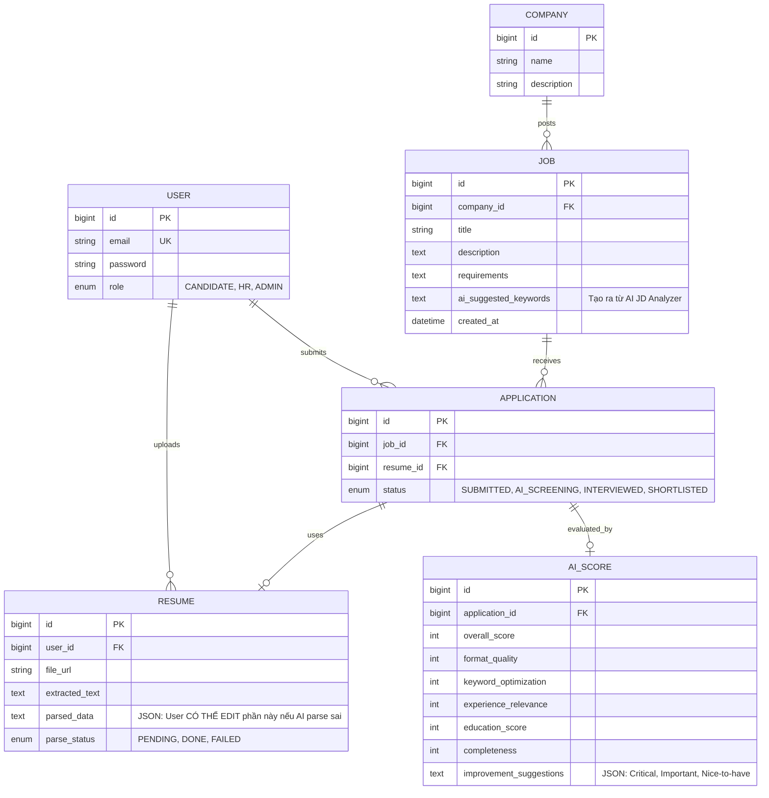

# AI-Hire: Master Implementation Plan
*Nền tảng Tuyển dụng & Phỏng vấn thông minh tích hợp AI*

---

## 1. TỔNG QUAN TÍNH NĂNG (Features)

Hệ thống kết hợp sức mạnh của LLM (Gemini), Message Broker (RabbitMQ) và Real-time WebSockets để tối ưu hóa quy trình tuyển dụng. Đã tích hợp các tính năng tinh hoa nhất:

### Dành cho Ứng viên (Candidate)
- **Upload CV & AI Parsing:** AI bóc tách thông tin (có thể tự chỉnh sửa lại nếu AI parse sai).
- **ATS Scoring:** Chấm điểm CV theo 5 tiêu chí: Format, Keywords, Experience, Education, Completeness.
- **AI Improvement Suggestions:** Gợi ý cách sửa CV (Critical, Important, Nice-to-have).
- **Quick Match Score:** Lướt xem Job thấy ngay % phù hợp.
- **AI Interview:** Phỏng vấn Chat-based trực tuyến, câu hỏi tự điều chỉnh độ khó (Adaptive).

### Dành cho Nhà tuyển dụng (HR/Admin)
- **AI JD Analyzer:** HR gõ Job Description, AI tự gợi ý thêm từ khóa kỹ năng còn thiếu.
- **Auto Re-scoring:** Khi HR thay đổi JD, hệ thống tự động chấm điểm lại toàn bộ CV đã nộp.
- **Candidate Ranking:** Bảng danh sách ứng viên tự động sắp xếp theo điểm AI Score.
- **AI Candidate Summary:** Tóm tắt điểm mạnh/yếu của ứng viên trong 1 đoạn văn, HR không cần đọc cả CV.

---

## 2. TECH STACK (Thực dụng & Nhanh gọn)

- **Backend:** Spring Boot 3.x, Java 17 (Monolithic Architecture - Dễ quản lý, code nhanh).
- **Database:** MySQL 8 (Lưu trữ chính) + Redis (Rate Limiting, Caching).
- **Message Queue:** RabbitMQ (Xử lý Parsing CV & Re-scoring bất đồng bộ).
- **AI Engine:** Google Gemini API (gemini-1.5-flash / pro).
- **File Processing:** Apache Tika (Bóc tách Text từ PDF/Docx) + MinIO (Lưu trữ file).
- **Security:** Spring Security + JWT + Redis Rate Limiting (Chống spam AI).
- **Frontend:** React 18, TypeScript, RTK Query, TailwindCSS, **shadcn/ui**.
- **DevOps:** Docker Compose (Chạy MySQL, Redis, RabbitMQ, MinIO nội bộ).

---

## 3. DATABASE SCHEMA (ERD)



---

## 4. API ENDPOINTS (Core)

| Method | Path | Mô tả |
|--------|------|--------|
| POST | `/api/v1/auth/register` | Đăng ký (Candidate/HR) |
| POST | `/api/v1/jobs` | HR tạo JD (Kích hoạt AI JD Analyzer) |
| PUT | `/api/v1/jobs/{id}` | HR sửa JD (Kích hoạt Auto Re-scoring CVs) |
| POST | `/api/v1/resumes/upload` | Candidate nộp CV -> Tika Parse -> Gemini Score |
| PUT | `/api/v1/resumes/{id}/parsed-data` | Candidate sửa lại dữ liệu AI parse sai |
| GET | `/api/v1/jobs/{id}/match-score` | Lấy Quick Match Score cho 1 Job |
| GET | `/api/v1/jobs/{id}/applicants` | HR xem danh sách ứng viên (Ranked by Score) |

---

## 5. AI PROMPT ENGINEERING

### Prompt chấm điểm CV (ATS Scoring)
```text
Đánh giá CV sau so với Job Description. 
Trả về JSON CHÍNH XÁC:
{
  "overall_score": <0-100>,
  "format_quality": <0-100>,
  "keyword_optimization": <0-100>,
  "experience_relevance": <0-100>,
  "education_score": <0-100>,
  "completeness": <0-100>,
  "matched_keywords": [...],
  "missing_keywords": [...],
  "ai_summary": "Đoạn tóm tắt điểm mạnh/yếu cho HR đọc...",
  "improvement_suggestions": [
    {
      "category": "CRITICAL",
      "advice": "Thêm từ khóa Docker vào phần kinh nghiệm"
    }
  ]
}
```

---

## 6. LUỒNG XỬ LÝ (System Flow)

```
┌──────────┐    ┌──────────┐    ┌───────────┐    ┌──────────┐    ┌──────────┐
│ Candidate│───>│ API      │───>│ RabbitMQ  │───>│ Consumer │───>│ Gemini   │
│ Upload   │    │ /upload  │    │ cv_queue  │    │ Worker   │    │ API      │
│ CV (PDF) │    │          │    │           │    │          │    │          │
└──────────┘    └────┬─────┘    └───────────┘    └────┬─────┘    └────┬─────┘
                     │                                │               │
                     │ 1.Lưu MinIO                    │ 2.Tika parse  │ 3.AI score
```

---

## 7. LỘ TRÌNH TRIỂN KHAI (5 Phases)

- **Phase 1: Foundation.** Setup Spring Boot, MySQL, Redis, RabbitMQ, MinIO qua Docker. Làm Authentication JWT.
- **Phase 2: Job & CV Management.** API cho phép HR tạo JD. API cho Candidate upload CV, dùng Apache Tika parse text. Cho phép Candidate sửa text.
- **Phase 3: AI Scoring Engine (CORE).** Tích hợp Gemini API. Viết worker RabbitMQ để chấm điểm CV ngầm. Thuật toán ATS Score.
- **Phase 4: AI Interview.** Làm WebSockets chat real-time. Logic AI đặt câu hỏi tương thích (Adaptive questions).
- **Phase 5: Frontend & Polish.** React Vite, shadcn/ui. Bảng xếp hạng ứng viên cho HR. Biểu đồ Radar cho Candidate.

---
[END OF PLAN]
