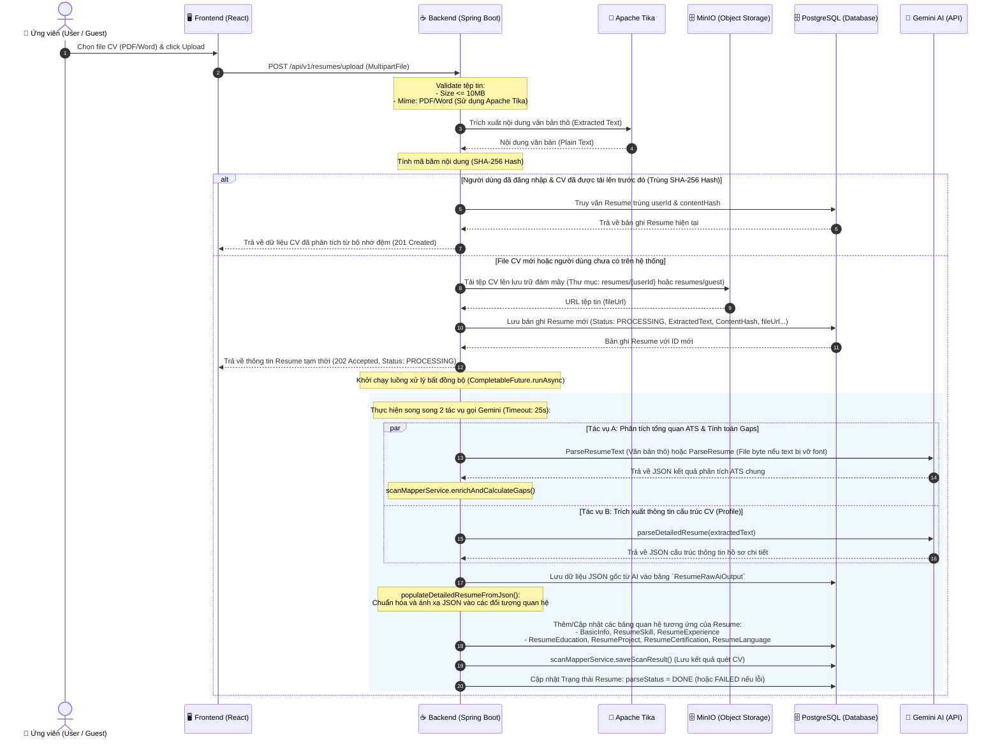
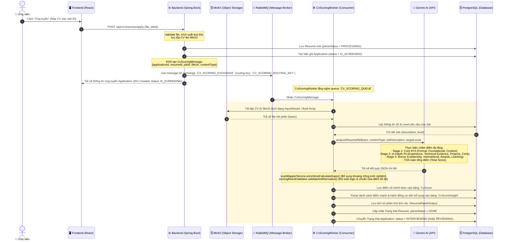
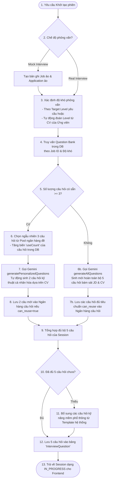
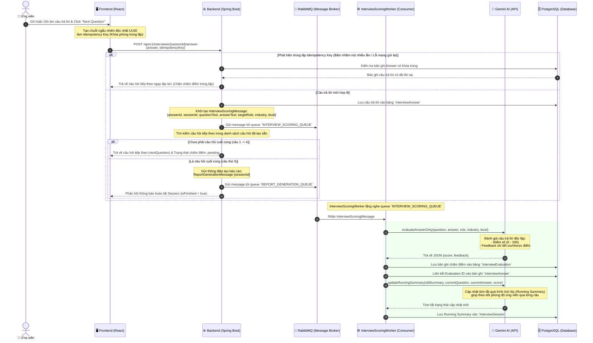
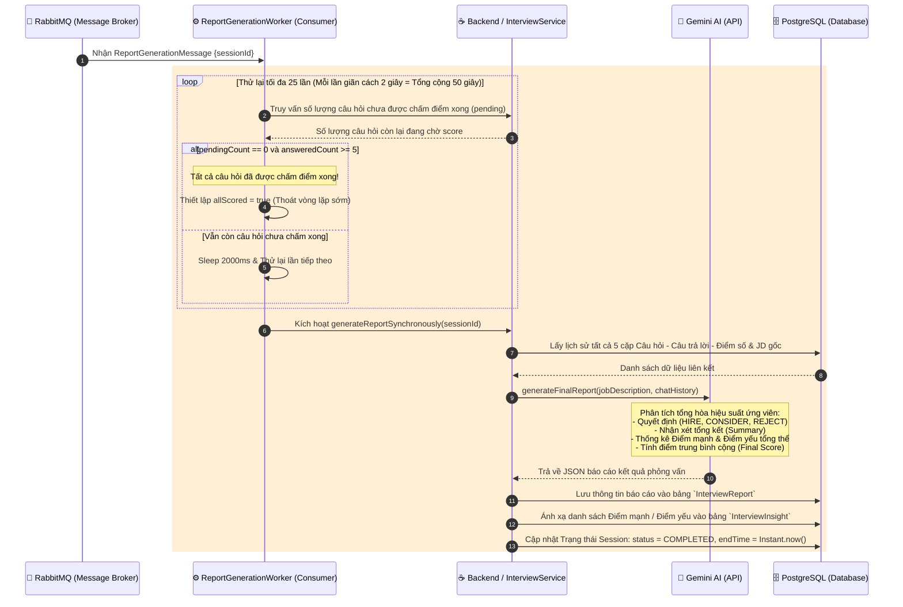

# TÀI LIỆU CHI TIẾT LUỒNG DỮ LIỆU: CV SCORING & INTERVIEW (AI-HIRES)

Tài liệu này mô tả chi tiết kiến trúc, các bước xử lý dữ liệu và cách thức tương tác giữa các thành phần (Frontend, Backend, RabbitMQ, MinIO, PostgreSQL, và Gemini AI) cho hai phân hệ cốt lõi của hệ thống **AI-Hires**: **Resume (CV Scan & Scoring)** và **Interview (Phỏng vấn thông minh)**.

---

## 1. LUỒNG DỮ LIỆU PHÂN HỆ RESUME (CV SCAN & SCORING)

Phân hệ CV chịu trách nhiệm xử lý 2 chức năng chính: **Tải lên & Phân tích cấu trúc CV (Upload & Parse)** và **Ứng tuyển & Chấm điểm CV theo Mô tả công việc (Apply & Score CV against JD)**.

### 1.1. Luồng 1: Tải lên & Phân tích cấu trúc CV (Upload & Parse CV)

Luồng này cho phép người dùng (hoặc khách vãng lai) tải CV lên để hệ thống phân tích thành cơ sở dữ liệu có cấu trúc (Thông tin cá nhân, Kỹ năng, Học vấn, Kinh nghiệm, Dự án, Chứng chỉ...).

#### Các bước dữ liệu chi tiết:
1. **Frontend**: Gửi API `POST /api/v1/resumes/upload` kèm file nhị phân.
2. **Backend Validation**: Sử dụng thư viện `Apache Tika` để kiểm tra MIME-type chính xác (PDF, DOCX) và tránh giả mạo đuôi file.
3. **Trích xuất Text**: Trích xuất text thô ngay lập tức để tính toán `SHA-256 Hash` làm khóa định danh duy nhất cho nội dung CV của User đó.
4. **Cơ chế Caching**: Nếu phát hiện trùng Hash của cùng một user, hệ thống lập tức trả về bản ghi cũ, giảm thiểu chi phí gọi Gemini API (tiết kiệm tài nguyên và thời gian chờ).
5. **Đồng bộ hóa / Bất đồng bộ**: 
   - Đồng bộ: Tải file lên MinIO, tạo bản ghi `Resume` với trạng thái `PROCESSING` và phản hồi lập tức cho Frontend trạng thái `202 Accepted` để UI không bị treo.
   - Bất đồng bộ: Khởi chạy luồng chạy ngầm bằng `CompletableFuture`. Gọi song song 2 Prompt của Gemini (một prompt cho định dạng ATS chung & tính khoảng trống kinh nghiệm, một prompt phân tích cấu trúc chi tiết thông tin hồ sơ).
6. **Chuẩn hóa quan hệ**: Sau khi có kết quả JSON từ Gemini, hệ thống phân tích cú pháp để đưa vào cơ sở dữ liệu quan hệ (PostgreSQL) nhằm phục vụ các tính năng lọc/tìm kiếm sau này.

---

### 1.2. Luồng 2: Ứng tuyển & Chấm điểm CV theo Mô tả công việc (Apply & Score CV)

Luồng này xảy ra khi ứng viên ứng tuyển vào một tin tuyển dụng (Job) cụ thể. Hệ thống sẽ tiến hành chấm điểm sâu tính tương thích của CV đối với các yêu cầu của JD.

#### Chi tiết các bước xử lý nghiệp vụ:
1. **Ứng tuyển**: Ứng viên nộp CV và chỉ định `jobId`.
2. **Xếp hàng đợi**: Do tác vụ chấm điểm so khớp CV - JD cực kỳ tốn thời gian (từ 10 - 20 giây tùy thuộc độ dài JD và cấu trúc CV), Backend không xử lý trực tiếp mà gửi một thông điệp `CvScoringMessage` vào **RabbitMQ** nhằm đảm bảo khả năng chịu tải và không làm nghẽn luồng HTTP chính.
3. **Hạ tầng Worker**: `CvScoringWorker` (một dịch vụ chạy ngầm) nhận tin nhắn, chủ động tải file CV từ MinIO và liên lạc với Gemini AI.
4. **Hệ thống chấm điểm đa tầng (Sprint 2 / v1.1 Weights)**:
   - **Stage 2 (Core ATS - Trọng số 50%)**: Đánh giá định dạng file, lỗi chính tả, thông tin liên lạc, cấu trúc phần mục CV và chất lượng từ khóa thô.
   - **Stage 3 (In-Depth - Trọng số 40%)**: Phân tích chuyên sâu về tiến trình sự nghiệp, chất lượng mô tả công việc (Bullet points), minh chứng kỹ năng thực tế, dự án lớn và chứng chỉ quốc tế.
   - **Stage 4 (Bonus - Trọng số 10%)**: Cộng điểm cho năng lực lãnh đạo, kinh nghiệm quốc tế, giải thưởng công nghệ hoặc khả năng tự học vượt trội.
5. **Bộ thẩm định (ScoringResultValidator)**: AI có thể đưa ra điểm số sai lệch so với khung quy định hoặc tính toán sai tổng điểm. Lớp Validation này sẽ quét cấu trúc JSON, bóc tách chuỗi điểm thô dạng `x/y`, ép giá trị điểm tối đa theo quy chuẩn hệ thống (ví dụ: `technical_evidence` tối đa 10 điểm), tính toán lại tổng điểm tuyệt đối, sửa đổi chuỗi hiển thị và trả về một cây JSON hoàn hảo trước khi lưu vào DB.

---

## 2. LUỒNG DỮ LIỆU PHÂN HỆ INTERVIEW (AI PHỎNG VẤN THÔNG MINH)

Hệ thống hỗ trợ cả 2 chế độ phỏng vấn: **Phỏng vấn tuyển dụng thực tế (Real Interview)** và **Phỏng vấn thử luyện tập (Mock Interview)**. Luồng nghiệp vụ tương tác bao gồm 3 giai đoạn: **Khởi tạo đề thi**, **Tương tác trả lời từng câu** và **Kết thúc & Tạo báo cáo đánh giá**.

### 2.1. Luồng 1: Khởi tạo phiên phỏng vấn (Start Session)

Giai đoạn chuẩn bị bộ câu hỏi cá nhân hóa dựa trên sự kết hợp độc đáo giữa Hồ sơ ứng viên (Resume) và Mô tả công việc (JD).

#### Chi tiết cơ chế nghiệp vụ Khởi tạo:
- **Cơ chế Hybrid Question Generation**: Để tối ưu chi phí và tăng tính nhất quán, hệ thống triển khai bộ chọn lọc lai:
  - Ưu tiên chọn 3 câu hỏi từ ngân hàng câu hỏi dùng chung (`InterviewQuestionBank`) tương ứng với Job và độ khó được thiết lập.
  - Sử dụng Gemini sinh thêm 2 câu hỏi mang tính chất "đào sâu" chuyên biệt dành riêng cho ứng viên (Personalized Questions) dựa trên kinh nghiệm trong CV của họ.
  - Nếu kho đề thi trống trải (dưới 3 câu), hệ thống gọi Gemini sinh toàn bộ 5 câu hỏi mới và phân tích hành vi tái sử dụng (`can_reuse = true`) để tự động bổ sung ngược lại kho đề dùng chung cho lần phỏng vấn sau.

---

### 2.2. Luồng 2: Tương tác nộp câu trả lời từng câu hỏi (Submit Answer Flow)

Ứng viên trả lời tuần tự câu hỏi bằng giọng nói/văn bản. Để mang lại trải nghiệm tối ưu nhất, việc chấm điểm câu trả lời được xử lý **bất đồng bộ hoàn toàn**.

#### Các điểm nổi bật trong kiểm soát dữ liệu:
1. **Idempotency Key (Khóa bất biến)**: Tránh lỗi trùng lặp dữ liệu và lãng phí API Gemini khi người dùng nhấp đúp nút "Nộp bài" hoặc thiết bị mạng gửi lại yêu cầu HTTP bị ngắt quãng. Khóa này đảm bảo mỗi câu trả lời chỉ được xử lý đúng một lần duy nhất.
2. **Scoring bất đồng bộ**: Khác với phiên bản cũ, điểm câu trả lời không cần chờ xử lý đồng bộ trên luồng HTTP. Trình duyệt ứng viên nhận ngay câu hỏi tiếp theo trong vòng dưới 100ms, giúp trải nghiệm mượt mà không có độ trễ.
3. **Running Summary**: Mỗi lần chấm điểm xong một câu, Worker gửi lại toàn bộ lược sử tóm tắt cũ kèm câu hỏi - câu trả lời mới để Gemini cập nhật một bản tóm tắt chạy ngầm (`runningSummary`). Dữ liệu này giúp lưu trữ "bối cảnh động" của ứng viên, cung cấp đầu vào chất lượng cao cho báo cáo tổng kết cuối cùng.

---

### 2.3. Luồng 3: Hoàn thành phiên & Xuất báo cáo đánh giá (Finish & Report Generation)

Kích hoạt sau khi ứng viên hoàn thành câu hỏi cuối cùng hoặc chủ động nhấn nút kết thúc phỏng vấn.

#### Phân tích luồng dữ liệu cuối kỳ:
1. **Cơ chế Polling an toàn trong Consumer**: Vì chấm điểm câu hỏi diễn ra bất đồng bộ, tại thời điểm ứng viên trả lời xong câu số 5, một số câu hỏi trước đó (ví dụ câu số 4) có thể vẫn đang được Gemini xử lý chấm điểm dở dang. `ReportGenerationWorker` sử dụng vòng lặp kiểm tra trạng thái trong DB (tối đa 25 lần thử x 2 giây = 50 giây) để đợi toàn bộ các câu trả lời đạt trạng thái `completed` (đã có điểm) rồi mới tổng hợp báo cáo.
2. **Quyết định phán quyết (Decision Matrix)**: Gemini phân tích toàn bộ cuộc hội thoại và đưa ra một trong ba trạng thái quyết định của hội đồng tuyển dụng ảo:
   - `HIRE` (Đề xuất nhận)
   - `CONSIDER` (Cân nhắc thêm)
   - `REJECT` (Loại)
3. **Lưu trữ chuẩn hóa**: Điểm số trung bình cộng và các điểm nhận xét chi tiết (Strengths / Weaknesses) được cấu trúc hóa vào bảng `InterviewReport` và `InterviewInsight` giúp cho quản trị viên/nhà tuyển dụng dễ dàng xem nhanh biểu đồ năng lực ứng viên trên giao diện dashboard của hệ thống.

---

## 3. DANH SÁCH CHI TIẾT CÁC ENDPOINT APIs

Dưới đây là bảng tổng hợp tất cả các Endpoint REST APIs được triển khai trong hệ thống cho hai Controller `ResumeController` và `InterviewController`.

### 3.1. Các Endpoints Quản lý & Phân tích CV (`ResumeController`)

| HTTP Method | API Path | Mô tả | Request Body / Params | Phản hồi chính (Success) | Trạng thái (HTTP) |
| :--- | :--- | :--- | :--- | :--- | :--- |
| **`POST`** | `/api/v1/resumes/upload` | Tải lên và phân tích cấu trúc CV (thông tin cá nhân, kỹ năng, kinh nghiệm...) | Form-data: `file` (MultipartFile) | Trả về `Resume` (Trạng thái `PROCESSING` hoặc `DONE` từ cache) | `201 Created` / `202 Accepted` |
| **`POST`** | `/api/v1/resumes/apply` | Nộp CV ứng tuyển vào một Công việc và tự động kích hoạt chấm điểm với JD | Form-data: `file` (MultipartFile), `jobId` (Long) | Trả về thông tin ứng tuyển `Application` với trạng thái `AI_SCREENING` | `201 Created` |
| **`GET`** | `/api/v1/resumes/{id}` | Lấy thông tin chi tiết một hồ sơ CV (thông tin thô, text trích xuất, cấu trúc) | Path: `id` (Long) | Trả về chi tiết đối tượng `Resume` | `200 OK` |
| **`GET`** | `/api/v1/resumes/my-resumes` | Lấy danh sách CV đã tải lên của người dùng hiện tại (hỗ trợ phân trang, lọc) | Query: `page`, `size`, `filter` (spring-filter Specification) | Trả về danh sách CV phân trang `ResultPaginationDTO` | `200 OK` |
| **`POST`** | `/api/v1/resumes/scan/{scanId}/feedback` | Gửi đánh giá phản hồi (rating, nhận xét) cho một kết quả Quét CV nhanh | Path: `scanId` (Long) Body: `{ "userRating": Integer, "userFeedback": String }` | Không có nội dung trả về | `200 OK` |
| **`POST`** | `/api/v1/resumes/application/{applicationId}/feedback` | Gửi đánh giá phản hồi cho kết quả Chấm điểm CV ứng tuyển chính thức | Path: `applicationId` (Long) Body: `{ "userRating": Integer, "userFeedback": String }` | Không có nội dung trả về | `200 OK` |

### 3.2. Các Endpoints Quản lý & Phỏng vấn thông minh (`InterviewController`)

| HTTP Method | API Path | Mô tả | Request Body / Params | Phản hồi chính (Success) | Trạng thái (HTTP) |
| :--- | :--- | :--- | :--- | :--- | :--- |
| **`POST`** | `/api/v1/interviews/extract-text` | Trích xuất nhanh văn bản thô từ tệp tin JD của công việc | Form-data: `file` (MultipartFile) | JSON chứa văn bản thô: `{ "text": "..." }` | `200 OK` |
| **`POST`** | `/api/v1/interviews/start` | Khởi tạo phiên phỏng vấn tuyển dụng chính thức (Real) liên kết đơn ứng tuyển | Body: `{ "applicationId": Long, "targetLevel": String (tùy chọn) }` | Trả về thông tin phiên `InterviewSession` | `200 OK` |
| **`POST`** | `/api/v1/interviews/start-mock` | Khởi tạo phiên phỏng vấn thử luyện tập (Mock) dựa trên CV và mô tả JD tùy chọn | Body: `{ "resumeId": Long, "targetRole": String, "jobDescription": String, "targetLevel": String (tùy chọn) }` | Trả về thông tin phiên `InterviewSession` | `200 OK` |
| **`GET`** | `/api/v1/interviews/{sessionId}` | Lấy thông tin trạng thái chi tiết của một phiên phỏng vấn | Path: `sessionId` (Long) | Trả về đối tượng `InterviewSession` | `200 OK` |
| **`GET`** | `/api/v1/interviews/{sessionId}/questions` | Lấy danh sách các câu hỏi hiển thị (các câu hỏi ứng viên đã hoặc đang trả lời) | Path: `sessionId` (Long) | Danh sách đối tượng `InterviewQuestion` | `200 OK` |
| **`POST`** | `/api/v1/interviews/{sessionId}/answer` | Nộp câu trả lời cho câu hỏi hiện tại trong phiên và kích hoạt chấm điểm ngầm | Path: `sessionId` (Long) Body: `{ "answer": String, "idempotencyKey": String }` | Trả về `InterviewSubmitAnswerResponseDTO` (nextQuestion, isFinished...) | `200 OK` |
| **`GET`** | `/api/v1/interviews/{sessionId}/scores` | Lấy trạng thái chấm điểm của tất cả các câu hỏi trong phiên (completed / pending / unanswered) | Path: `sessionId` (Long) | Trả về danh sách trạng thái điểm các câu hỏi | `200 OK` |
| **`POST`** | `/api/v1/interviews/{sessionId}/finish` | Yêu cầu kết thúc sớm phiên phỏng vấn và kích hoạt tạo báo cáo cuối cùng | Path: `sessionId` (Long) | Trả về đối tượng `InterviewSession` | `200 OK` |
| **`GET`** | `/api/v1/interviews/{sessionId}/report` | Lấy báo cáo đánh giá phỏng vấn tổng hợp cuối cùng từ AI (điểm số, quyết định, điểm mạnh/yếu) | Path: `sessionId` (Long) | Trả về đối tượng `InterviewReport` hoặc `404 Not Found` nếu chưa tạo xong | `200 OK` / `404 Not Found` |
| **`GET`** | `/api/v1/interviews/my-sessions` | Lấy danh sách lịch sử các phiên phỏng vấn thử (Mock) của người dùng hiện tại | Query: `page`, `size`, `filter` (spring-filter Specification) | Trả về danh sách phiên phỏng vấn phân trang `ResultPaginationDTO` | `200 OK` |

---

## 4. DANH SÁCH CÁC BẢNG DỮ LIỆU LIÊN QUAN TRONG HỆ THỐNG (POSTGRESQL)

| Tên Bảng (Entity) | Vai Trò | Mối Quan Hệ (Relationship) |
| :--- | :--- | :--- |
| **`Resume`** | Lưu trữ tệp CV gốc, nội dung văn bản thô trích xuất và trạng thái xử lý tổng quan. | `ManyToOne` với `User` |
| **`ResumeRawAiOutput`** | Lưu trữ chuỗi JSON nguyên bản phản hồi từ Gemini (ATS JSON và Profile JSON). | `OneToOne` với `Resume` |
| **`ResumeScan`** | Lưu kết quả quét CV nhanh dành cho Khách vãng lai kèm đánh giá phản hồi. | `ManyToOne` với `User` (nếu có) |
| **`Application`**| Đơn ứng tuyển liên kết giữa một Hồ sơ ứng viên và một Công việc cụ thể. | Liên kết `Resume` và `Job` |
| **`CvScore`** | Điểm số đánh giá chi tiết đa tầng giữa CV và JD. | `OneToOne` với `Application` |
| **`CvScoreInsight`** | Lưu trữ danh sách các điểm mạnh và các hành động cần ưu tiên nâng cấp của CV. | `ManyToOne` với `CvScore` |
| **`InterviewSession`** | Phiên phỏng vấn (Lưu độ khó, loại, trạng thái xử lý, tóm tắt diễn biến cuộc thoại). | `OneToOne` với `Application` |
| **`InterviewQuestion`** | Danh sách các câu hỏi cụ thể được sinh ra hoặc rút ra từ kho đề cho một phiên. | `ManyToOne` với `InterviewSession` |
| **`InterviewAnswer`** | Bản ghi câu trả lời bằng văn bản của ứng viên kèm theo khóa phòng trùng. | `OneToOne` với `InterviewQuestion` |
| **`InterviewEvaluation`**| Điểm số và phản hồi chi tiết của AI cho duy nhất một câu trả lời. | `OneToOne` với `InterviewAnswer` |
| **`AnswerScore`** | Điểm số chi tiết được bóc tách theo từng tiêu chí tuyển dụng (Criteria). | `ManyToOne` với `InterviewAnswer` |
| **`InterviewQuestionBank`**| Ngân hàng câu hỏi tái sử dụng để làm phong phú kho đề theo Job Title và Level. | `ManyToOne` với `Job` |
| **`InterviewReport`** | Báo cáo phỏng vấn cuối cùng chứa tóm tắt, điểm trung bình và quyết định tuyển dụng.| `OneToOne` với `InterviewSession` |
| **`InterviewInsight`** | Tập hợp các nhận xét về Điểm mạnh & Điểm yếu cốt lõi trong báo cáo cuối kỳ. | `ManyToOne` với `InterviewReport` |

---

> [!NOTE]  
> Các luồng dữ liệu trên được xây dựng tuân thủ nghiêm ngặt mô hình kiến trúc hướng sự kiện (Event-Driven Architecture) thông qua RabbitMQ, giúp giảm tải tối đa cho máy chủ HTTP Spring Boot và cung cấp trải nghiệm mượt mà, tức thì cho người dùng tại giao diện Frontend.

