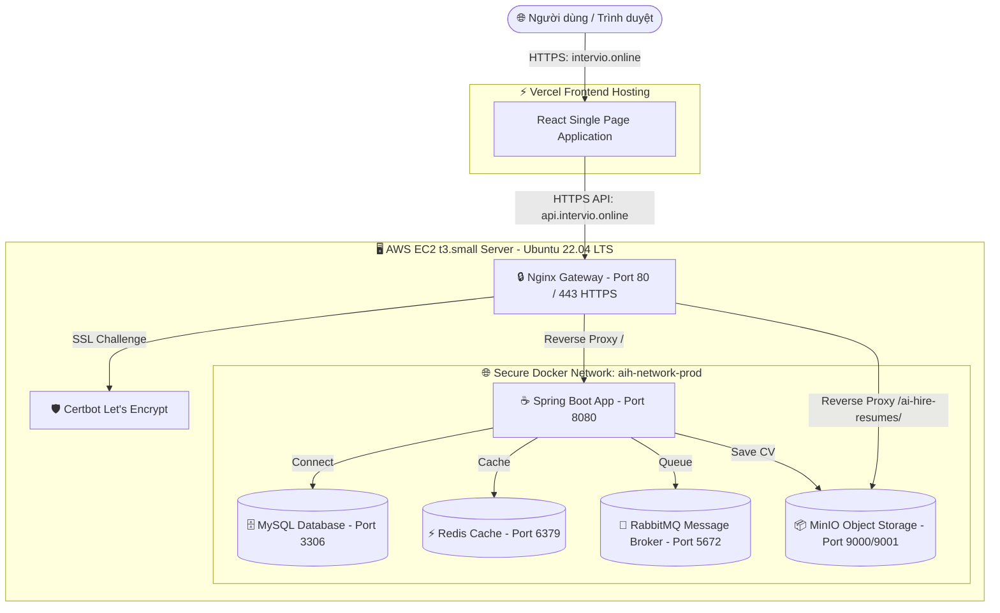

# 🚀 INTERVIO: Next-Gen AI Recruitment Platform

<p align="center">
  
  
  
  
  
  
  
  
  
</p>

**Intervio** (`intervio.online`) là một nền tảng tuyển dụng thông minh thế hệ mới, ứng dụng sức mạnh của Trí tuệ nhân tạo (Generative AI - Google Gemini 1.5 Flash/3.1) để tự động hóa hoàn toàn quy trình phân tích CV, sàng lọc hồ sơ ứng viên và chấm điểm độ tương thích với mô tả công việc (JD - Job Description) theo thời gian thực.

---

## 🎨 Hệ thống Tính năng chính (Core Features)

*   **🤖 AI-Powered CV Parsing & Analysis:** Sử dụng Gemini AI phân tích sâu nội dung CV (PDF, Docx), tự động trích xuất kỹ năng, kinh nghiệm, học văn thành cấu trúc JSON chuẩn.
*   **📊 Smart Job Matching & Scoring:** Chấm điểm % độ phù hợp của từng ứng viên đối với các tiêu chí tuyển dụng trong JD nhờ thuật toán đối sánh ngữ nghĩa của AI.
*   **🔒 Bảo mật đa lớp (Security):** Tích hợp Spring Security & OAuth2 Resource Server cấp phát mã xác thực qua cặp khóa Access/Refresh Token (JWT).
*   **🛡️ Phân quyền động (Dynamic RBAC):** Quản lý vai trò (Role) và quyền hạn (Permission) linh hoạt trực tiếp từ Database, chặn API bất hợp lệ theo thời gian thực.
*   **📂 Object Storage tập trung:** Quản lý và lưu trữ hồ sơ CV an toàn, tối ưu hiệu suất với hệ sinh thái MinIO nội bộ.
*   **⚡ Xử lý bất đồng bộ (Asynchronous Queue):** Sử dụng hàng đợi RabbitMQ giải quyết các tác vụ nặng (parse dữ liệu AI, gửi email) giúp hệ thống không bao giờ nghẽn.
*   **🚀 Caching & Session:** Tối ưu hóa hiệu năng truy vấn dữ liệu nhanh với Redis.
*   **📱 Giao diện Premium:** Frontend React hiện đại thiết kế responsive trên mọi loại thiết bị di động, máy tính bảng và PC.

---

## 🏗️ Kiến trúc Triển khai Sản xuất (Production Architecture)

Nền tảng được thiết kế theo kiến trúc chuẩn **Single-Node Cloud Native**, tối ưu chi phí hạ tầng mà vẫn đảm bảo tính an toàn bảo mật tuyệt đối nhờ Docker Container hóa.

### 🌐 Sơ đồ Hạ tầng & Định tuyến Mạng (Network & Infrastructure Topology)



---

## 🔒 Quy chuẩn An toàn Bảo mật Cổng (Port Mapping Matrix)

Nhằm đảm bảo an toàn tối đa cho hệ thống cơ sở dữ liệu và hàng đợi nhạy cảm, toàn bộ các dịch vụ lưu trữ bên trong Docker đều được cấu hình **bind cứng vào Localhost (`127.0.0.1`)** trên Firewall của AWS:

| Tên Dịch Vụ | Cổng Container | Cổng Host (AWS EC2) | Trạng Thái Công Cộng (Public) | Cơ Chế Bảo Mật & Kết Nối |
| :--- | :---: | :---: | :---: | :--- |
| **HTTP Web** | `80` | `80` | **MỞ (Public)** | Certbot ACME Challenge & Tự động Redirect 301 sang 443 HTTPS |
| **HTTPS Web** | `443` | `443` | **MỞ (Public)** | Cổng API chính thức, mã hóa TLS 1.3 bảo mật cao |
| **Spring Boot API** | `8080` | Không Map | **ĐÓNG (Private)** | Chỉ cho phép kết nối nội bộ từ Nginx Gateway |
| **MySQL DB** | `3306` | `127.0.0.1:3306` | **ĐÓNG (Private)** | Chỉ cho phép quản trị viên EC2 kết nối từ Localhost |
| **Redis Cache** | `6379` | `127.0.0.1:6379` | **ĐÓNG (Private)** | Chỉ cho phép truy cập local nội bộ |
| **RabbitMQ Core** | `5672` | `127.0.0.1:5672` | **ĐÓNG (Private)** | Chỉ cho phép kết nối từ nội bộ Docker Network |
| **RabbitMQ Console** | `15672` | `127.0.0.1:15672` | **ĐÓNG (Private)** | Quản trị an toàn thông qua cổng **SSH Tunneling** từ máy cá nhân |
| **MinIO API** | `9000` | `127.0.0.1:9000` | **ĐÓNG (Private)** | Truy cập gián tiếp thông qua Reverse Proxy của Nginx |
| **MinIO Console** | `9001` | `127.0.0.1:9001` | **ĐÓNG (Private)** | Quản trị an toàn thông qua Reverse Proxy cấu hình bảo mật mật khẩu |

---

## 🛠️ Hướng dẫn Triển khai nhanh (Production Deployment Guide)

### 1. Chuẩn bị môi trường trên Ubuntu Server
Cài đặt bộ nhớ RAM ảo (SWAP 4GB) để đảm bảo hệ thống `t3.small` không bao giờ bị tràn RAM khi vận hành:
```bash
sudo fallocate -l 4G /swapfile
sudo chmod 600 /swapfile
sudo mkswap /swapfile
sudo swapon /swapfile
echo '/swapfile none swap sw 0 0' | sudo tee -a /etc/fstab
```

### 2. Cài đặt Docker & Docker Compose v2
```bash
sudo apt update && sudo apt upgrade -y
sudo apt install -y apt-transport-https ca-certificates curl software-properties-common gnupg lsb-release
sudo mkdir -p /etc/apt/keyrings
curl -fsSL https://download.docker.com/linux/ubuntu/gpg | sudo gpg --dearmor -o /etc/apt/keyrings/docker.gpg
echo "deb [arch=$(dpkg --print-architecture) signed-by=/etc/apt/keyrings/docker.gpg] https://download.docker.com/linux/ubuntu $(lsb_release -cs) stable" | sudo tee /etc/apt/sources.list.d/docker.list > /dev/null
sudo apt update && sudo apt install -y docker-ce docker-ce-cli containerd.io docker-buildx-plugin docker-compose-plugin
sudo systemctl enable docker && sudo systemctl start docker
sudo usermod -aG docker $USER
```

### 3. Clone mã nguồn và cấu hình tệp `.env`
```bash
git clone https://github.com/TuanAnh/AI-Hires.git
cd AI-Hires/backend
nano .env
```
Điền đầy đủ thông tin mật khẩu bảo mật và khóa **Gemini API Key** của bạn.

### 4. Thiết lập Chứng Chỉ SSL Let's Encrypt & Chạy Hệ Thống
Khởi tạo chứng chỉ giả lập để kích hoạt Nginx lần đầu:
```bash
docker compose -f docker-compose.prod.yml run --rm --entrypoint sh certbot -c "mkdir -p /etc/letsencrypt/live/api.intervio.online && openssl req -x509 -nodes -newkey rsa:2048 -days 1 -keyout /etc/letsencrypt/live/api.intervio.online/privkey.pem -out /etc/letsencrypt/live/api.intervio.online/fullchain.pem -subj '/CN=localhost'"
```

Khởi chạy hệ thống docker:
```bash
docker compose -f docker-compose.prod.yml up -d
```

Đăng ký chứng chỉ Let's Encrypt thật (thay email thật của bạn):
```bash
docker compose -f docker-compose.prod.yml run --rm --entrypoint "certbot" certbot certonly --webroot --webroot-path=/var/www/certbot -d api.intervio.online --email your-email@gmail.com --agree-tos --no-eff-email --force-renewal
```

Đồng bộ chứng chỉ Let's Encrypt thật và reload lại Nginx:
```bash
docker compose -f docker-compose.prod.yml run --rm --entrypoint sh certbot -c "mkdir -p /etc/letsencrypt/live/api.intervio.online && cp -L /etc/letsencrypt/live/api.intervio.online-0001/* /etc/letsencrypt/live/api.intervio.online/"
docker compose -f docker-compose.prod.yml exec nginx nginx -s reload
```

---

## 🤖 Thiết lập Tự động hóa CI/CD với GitHub Actions

Hệ thống đã tích hợp sẵn luồng triển khai tự động cực kỳ tinh gọn thông qua thư viện SSH chuẩn hóa tại [.github/workflows/deploy.yml](.github/workflows/deploy.yml).

Mỗi khi bạn đẩy (push) code mới lên nhánh **`main`**, GitHub Actions sẽ:
1. Kết nối an sau qua giao thức SSH vào máy chủ AWS EC2.
2. Tự động chạy lệnh `git pull` cập nhật toàn bộ mã nguồn backend, nginx.
3. Kích hoạt lệnh `docker compose up -d --build` đóng gói cục bộ không gián đoạn dịch vụ.
4. Tự động dọn dẹp các bản build Docker dư thừa để tiết kiệm bộ nhớ máy chủ.

### 🔑 Các biến môi trường cần cấu hình trong Repository Secrets:
*   `HOST`: Địa chỉ IP tĩnh máy chủ (**`18.142.190.29`**).
*   `USERNAME`: Tài khoản đăng nhập SSH (**`ubuntu`**).
*   `SSH_KEY`: Toàn bộ chuỗi ký tự bên trong file mã khóa riêng tư **`intervio.pem`**.

---

⭐ **INTERVIO** - *Sự đột phá toàn diện trong quy trình số hóa và tự động hóa tuyển dụng nhân sự bằng trí tuệ nhân tạo Generative AI.*
