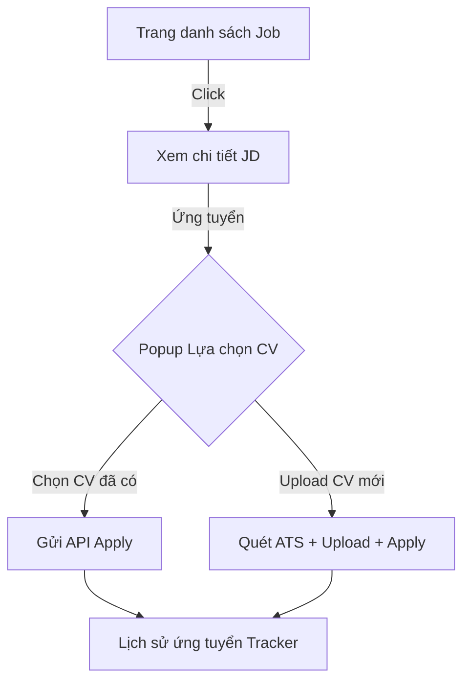

# 🗺️ Kế hoạch chi tiết Phát triển & Hoàn thiện Frontend Intervio (AI-Hires)

Tài liệu này vạch ra lộ trình toàn diện để xây dựng, tái cấu trúc và hoàn thiện các chức năng còn thiếu ở phía Frontend của dự án **Intervio** (React, TypeScript, Vite, Tailwind CSS, Shadcn UI), đồng bộ hóa 100% với các API hiện có ở phía Backend Spring Boot.

---

## 📌 Khảo sát trạng thái hiện tại (Current Status)

### Chức năng đã có:
*   **Xác thực (Auth)**: Đăng nhập, Đăng ký, Quên/Đặt lại mật khẩu.
*   **Trình kiểm tra CV (CvChecker/Analysis)**: Giao diện kéo thả CV, phân tích điểm số ATS tổng quan.
*   **Trình mô phỏng phỏng vấn (Interview)**: Giao diện phòng phỏng vấn tương tác AI, bộ đếm giờ, hộp thoại trả lời và hiển thị kết quả phỏng vấn.
*   **Cài đặt tài khoản (Profile)**: Thay đổi thông tin cá nhân cơ bản.
*   **Admin tối giản**: Giao diện cấu hình Scoring, quản lý câu hỏi phỏng vấn cơ bản.

### Chức năng còn thiếu (Chưa có giao diện kết nối API):
1.  **Cổng thông tin việc làm (Job Board & JD Directory)**: Tìm kiếm, lọc và xem chi tiết tin tuyển dụng (Job Description).
2.  **Hồ sơ ứng viên & Quản lý CV (Candidate Resume Hub)**: Nơi lưu trữ danh sách CV đã tải lên, lịch sử chấm điểm ATS chi tiết cho từng bản CV.
3.  **Tiến trình ứng tuyển (Application Tracker)**: Theo dõi trạng thái hồ sơ của ứng viên (Applied, Screening, Interviewing, Offered, Rejected).
4.  **Cổng thông tin nhà tuyển dụng (HR Portal)**:
    *   Quản lý thông tin công ty (Company Profile).
    *   Tạo mới, chỉnh sửa, đóng/mở tin tuyển dụng (Job Management).
    *   Quản lý danh sách ứng viên ứng tuyển, xem bảng so sánh điểm so khớp ATS CV với JD.
    *   Kích hoạt và xem báo cáo Phỏng vấn AI của ứng viên.
5.  **Hệ thống quản trị Admin nâng cao**: Quản lý danh sách người dùng, kích hoạt/vô hiệu hóa tài khoản, phân quyền Role (ADMIN, HR, CANDIDATE).

---

## 🗓️ Lộ trình phát triển 5 Giai đoạn (5-Phase Roadmap)

### 🎨 Giai đoạn 1: Thiết lập Hệ thống Điều hướng & Phân quyền Role (UI/UX Foundation)
**Mục tiêu**: Xây dựng cấu trúc layout linh hoạt, tự động chuyển đổi menu điều hướng dựa trên Role của người dùng sau khi đăng nhập.

*   **Task 1.1: Tái cấu trúc Menu Điều hướng (Dynamic Header & Sidebar)**
    *   *Candidate*: Menu gồm `Tìm việc làm`, `CV của tôi`, `Lịch sử ứng tuyển`, `Lịch sử phỏng vấn`.
    *   *HR*: Menu gồm `Tổng quan (Dashboard HR)`, `Quản lý tin tuyển dụng`, `Danh sách ứng tuyển`, `Hồ sơ công ty`.
    *   *Admin*: Menu gồm `Cấu hình điểm (Scoring)`, `Bộ câu hỏi`, `Quản lý người dùng`, `System Logs`.
*   **Task 1.2: Bảo mật Route theo Role (Role-based Protected Routes)**
    *   Cấu hình `RequireAuth` trong `App.tsx` hỗ trợ kiểm tra chi tiết danh sách quyền (`permissions`) hoặc vai trò (`role`) của user từ API `GET /api/v1/auth/account`.
*   **Task 1.3: Đồng bộ hóa Context & LocalStorage**
    *   Đảm bảo sau khi đăng nhập, Token JWT được lưu trữ an toàn, tự động nạp thông tin User và phân quyền mà không bị mất trạng thái khi Refresh trang.

---

### 💼 Giai đoạn 2: Cổng thông tin Ứng viên (Candidate Hub) & Tin tuyển dụng
**Mục tiêu**: Hiện thực hóa luồng tìm việc, quản lý CV cá nhân và ứng tuyển trực tuyến.

*   **Task 2.1: Trang tìm kiếm và danh sách Việc làm (`/jobs`)**
    *   Thiết kế giao diện thẻ việc làm sang trọng (glassmorphism), hỗ trợ tìm kiếm theo từ khóa và lọc nhanh theo cấp bậc (Level), kỹ năng (Skills).
    *   Kết nối API `GET /api/v1/jobs`.
*   **Task 2.2: Trang chi tiết việc làm (`/jobs/:id`)**
    *   Hiển thị chi tiết yêu cầu công việc (JD), mức lương, địa điểm, chế độ đãi ngộ.
    *   Nút bấm "Ứng tuyển ngay" mở Modal lựa chọn hồ sơ.
*   **Task 2.3: Modal ứng tuyển thông minh (Apply Modal)**
    *   Cho phép ứng viên: (1) Chọn một CV đã tải lên trước đó, hoặc (2) Kéo thả tải lên một CV mới.
    *   Kết nối API `POST /api/v1/resumes/apply` và đồng thời chạy phân tích điểm so khớp ATS CV với JD đó.
*   **Task 2.4: Trung tâm quản lý CV & Ứng tuyển (`/my-resumes` & `/applications`)**
    *   **CV Locker**: Hiển thị danh sách các CV đã tải lên kèm theo điểm phân tích ATS gần nhất. Kết nối `GET /api/v1/resumes/my-resumes`.
    *   **Application Tracker**: Giao diện timeline Kanban hoặc danh sách theo dõi tiến độ hồ sơ (đã nộp ➡️ đang sàng lọc ➡️ mời phỏng vấn AI ➡️ nhận Offer/Từ chối).

---

### 👔 Giai đoạn 3: Cổng thông tin Nhà tuyển dụng (HR Portal)
**Mục tiêu**: Xây dựng bộ công cụ quản trị chiến dịch tuyển dụng, sàng lọc hồ sơ ứng viên bằng AI dành cho HR.

*   **Task 3.1: Giao diện quản lý Tin tuyển dụng (`/hr/jobs`)**
    *   Danh sách các tin tuyển dụng đang mở/đóng.
    *   Trình soạn thảo tạo mới JD: Nhập chức danh, mô tả công việc, các kỹ năng kỹ thuật trọng tâm để AI so khớp.
    *   Kết nối API `POST/PUT/DELETE /api/v1/jobs`.
*   **Task 3.2: Giao diện thông tin Công ty (`/hr/company`)**
    *   Cập nhật logo, tên thương hiệu, website, mô tả công ty để hiển thị trên tin tuyển dụng.
    *   Kết nối API `GET/PUT /api/v1/companies`.
*   **Task 3.3: Trang quản lý Hồ sơ ứng tuyển (Applicant Management)**
    *   Danh sách ứng viên đã nộp hồ sơ vào từng Job.
    *   Hiển thị nổi bật **Điểm số so khớp AI (ATS Match Score)** và các điểm thành phần (Kinh nghiệm, Kỹ năng, Học vấn).
    *   Nút hành động: "Mời phỏng vấn AI" (Tự động kích hoạt/gửi mail mời ứng viên thực hiện phỏng vấn trên hệ thống).
    *   Kết nối API `GET /api/v1/applications`.

---

### 🛡️ Giai đoạn 4: Hệ thống Quản trị Admin nâng cao (Admin Panel Upgrade)
**Mục tiêu**: Mở rộng quyền lực kiểm soát hệ thống cho Admin quản trị toàn bộ người dùng và hệ thống core.

*   **Task 4.1: Trang quản trị người dùng (`/admin/users`)**
    *   Bảng hiển thị toàn bộ người dùng trong hệ thống (Avatar, Email, Vai trò, Trạng thái hoạt động).
    *   Chức năng chỉnh sửa vai trò (Gán quyền ADMIN / HR / CANDIDATE) và khóa/mở khóa tài khoản.
    *   Kết nối API `GET/PUT/DELETE /api/v1/users`.
*   **Task 4.2: Tối ưu hóa trang cấu hình câu hỏi phỏng vấn (`/admin/questions`)**
    *   Cho phép Admin quản lý ngân hàng câu hỏi mẫu theo từng lĩnh vực kỹ thuật để AI lấy làm dữ liệu tham chiếu khi tạo buổi phỏng vấn.
*   **Task 4.3: Theo dõi Log hệ thống (`/admin/logs`)**
    *   Giao diện hiển thị trực quan các hoạt động của hệ thống (lịch sử đăng nhập, hoạt động quét CV, các lệnh gọi API Gemini).

---

### 🚀 Giai đoạn 5: Tối ưu hóa UI/UX, Trải nghiệm Phỏng vấn AI & Đóng gói
**Mục tiêu**: Tối ưu hóa sâu trải nghiệm người dùng, đặc biệt là luồng phỏng vấn trực tiếp bằng giọng nói và kiểm thử hiệu năng.

*   **Task 5.1: Tích hợp ghi âm giọng nói & Chuyển đổi giọng nói thành văn bản (Speech-to-Text)**
    *   Tại phòng phỏng vấn `/interview`, nâng cấp trình ghi âm sử dụng Web Audio API. Tích hợp thư viện nhận dạng giọng nói tự động (hoặc truyền trực tiếp file ghi âm lên API Whisper/Gemini nếu backend có hỗ trợ) để ứng viên có thể phỏng vấn bằng cách nói trực tiếp thay vì chỉ gõ chữ.
*   **Task 5.2: Trực quan hóa dữ liệu điểm số (Data Visualization)**
    *   Sử dụng thư viện biểu đồ (như `Recharts` hoặc `Chart.js`) để vẽ biểu đồ mạng nhện (Radar Chart) so sánh năng lực của ứng viên trong trang kết quả phỏng vấn `/interview/results/:id` và kết quả quét CV `/results`.
*   **Task 5.3: Hoàn thiện SEO & Hiệu năng tải trang**
    *   Tối ưu hóa Lazy loading cho toàn bộ các route mới để giữ điểm số Lighthouse > 90.
    *   Cấu hình thẻ tiêu đề và meta động qua `react-helmet-async` cho từng trang.

---

## 📝 Tiêu chí nghiệm thu (Definition of Done)

*   [ ] Toàn bộ các API endpoints tương ứng ở Backend đều được kết nối thành công và có xử lý lỗi (catch error) đầy đủ.
*   [ ] Giao diện được thiết kế đồng bộ theo phong cách hiện đại (Premium Dark Theme/Vibrant gradients) sử dụng Shadcn UI và Tailwind CSS.
*   [ ] Phân quyền Route hoạt động hoàn hảo: Ứng viên không thể vào trang HR/Admin, HR không thể vào trang Admin.
*   [ ] Toàn bộ các biểu mẫu (Forms) đều được validate dữ liệu đầu vào chặt chẽ ở Client bằng `React Hook Form` và `Zod`.
*   [ ] Đã kiểm thử responsive mượt mà trên cả Mobile, Tablet và Desktop.
*   [ ] Code sạch, chia nhỏ component tái sử dụng tốt, tuân thủ đúng luật định hình trong `.clinerules` và `CLAUDE.md`.
